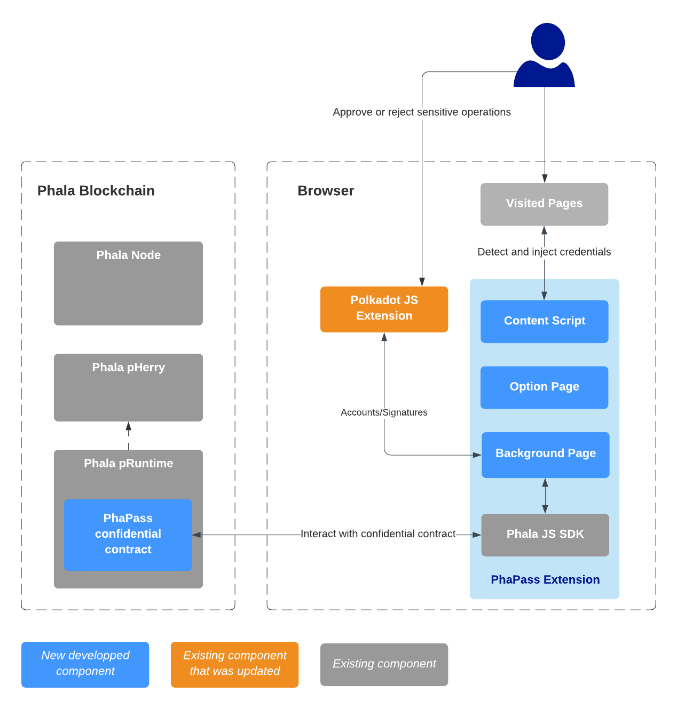

# PhaPass, a password manager on Phala

_Work In Progress_

A project for the [Advanced Phala Challenge](https://github.com/Phala-Network/Encode-Hackathon-2021/blob/master/advanced-challenge.md) of the [Encode Polkadot Hackathon](https://www.encode.club/polkadot-club-hackathon).

It tries to demonstrate how we could rely on the Phala Confidential Contract feature to keep track of passwords.

This repository holds the PhaPass blockchain code, which implements the [PhaPass contract](./crates/phactory/src/contracts/phapass.rs).
See the [Phala instructions](./README.phala.md) on how to build and run the blockchain.

The frontend part of this project is served by a [Chrome Extension](https://developer.chrome.com/docs/extensions/) based on the [Phala JS SDK](https://github.com/Phala-Network/js-sdk). The related code can be found in [this fork](https://github.com/LaurentTrk/js-sdk).

:warning: As a Hackathon project, this is not ready for production use. Use it at your own risks :)

## Inspiration

## What it does

### Store your passwords in a Phala confidential contract

### From a technical point of view

Technically, the project is all about developing a Phala contract to store and deal with user credentials, and a Chrome Browser Extension that will use this contract.

* **PhaPass Confidential Contract** : the contract running in the Phala blockchain.
* **Background Page** : this page interacts with the confidential contract using the Phala JS SDK. It serves as a 'backend' for the content script and the options page. 
* **Option Page**: the unique UI of the extension. It displays a tutorial for the user vault creation, or the list of the user credentials.
* **Content Script**: this code is injected into the visited page, it detects manually input credentials to save to the user vault, or inject already saved credentials in visited page.

## How I built it

### xxxx

## Challenges I ran into

## What's next