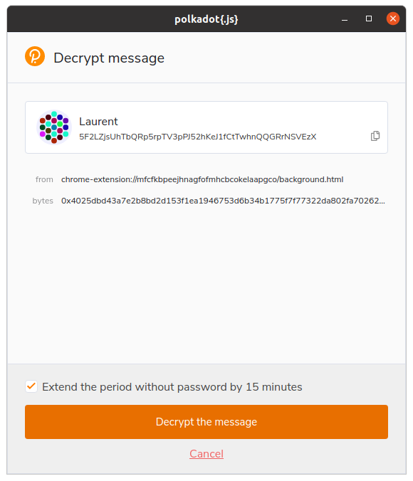
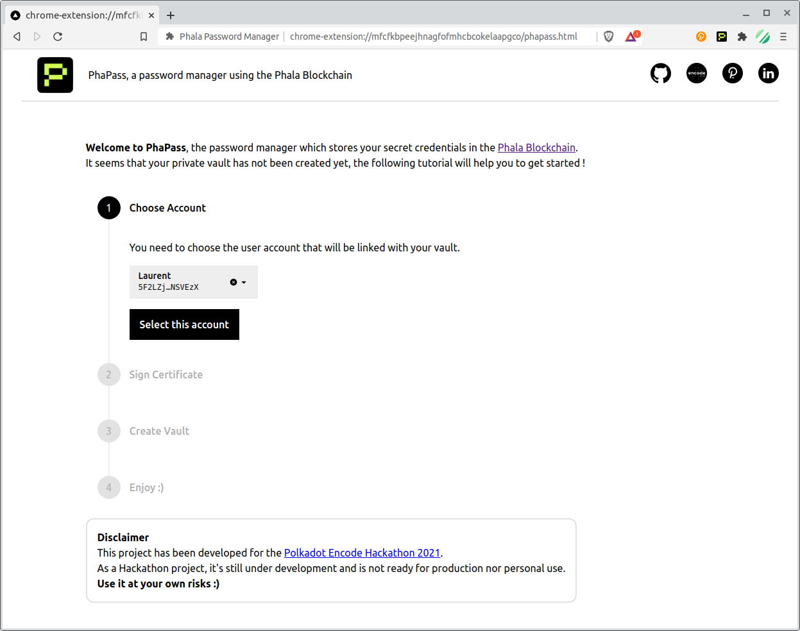

This project has been developed for the [Advanced Phala Challenge](https://github.com/Phala-Network/Encode-Hackathon-2021/blob/master/advanced-challenge.md) of the [Encode Polkadot Hackathon](https://www.encode.club/polkadot-club-hackathon).

It tries to demonstrate how we could rely on the Phala Confidential Contract feature to keep track of passwords, providing a **non custodial and decentralized password manager**, embedded in a browser extension.

{: .box-note}
As the project requires non published custom browser extensions and deals with sensitive informations (your passwords !), there is no online demo of the project but you could have a look at [this short video](https://www.youtube.com/watch?v=dQw4w9WgXcQ) to see how it works.

[This repository](https://github.com/LaurentTrk/phapass) holds the PhaPass blockchain code, which implements the [PhaPass contract](https://github.com/LaurentTrk/phapass/blob/phapass/crates/phactory/src/contracts/phapass.rs).

See the [Phala instructions](https://github.com/LaurentTrk/phapass/blob/phapass/README.phala.md) on how to build and run the blockchain.

The frontend part of this project is served by a [Chrome Extension](https://developer.chrome.com/docs/extensions/) based on the [Phala JS SDK](https://github.com/Phala-Network/js-sdk). The related code can be found in [this fork](https://github.com/LaurentTrk/js-sdk).

{: .box-warning}
As a Hackathon project, this is not ready for production use.  
**Use it at your own risks :)**

---

## Inspiration

I have been using a password manager for many years now, but sometimes I have doubts about the privacy and security of the data I store there.

Of course, these applications are often opensource and regularly audited, but they are still proprietary solutions, or you have to manage the synchronization and backup of your data yourself, often using other proprietary cloud solutions.

**All this remains very centralized...**

I discovered [Phala](https://phala.network/) last year during the [Polkadot Hello World hackathon](https://gitcoin.co/hackathon/polkadot/onboard), and I thought that this decentralized blockchain and its [trusted and confidential](https://phala.network/en/technology) nature could be the perfect candidate for an experimentation around password management.

And so here is the **PhaPass** project, which aims to demonstrate how you can use the Phala blockchain to store your passwords and use them directly in your favorite browser :)

---

## How it works ?

Technically, the project is all about developing a Phala contract to store and deal with user credentials, and a Chrome Browser Extension that will use this contract.

* **PhaPass Confidential Contract** : the contract running in the Phala blockchain.
* **Background Page** : this page interacts with the confidential contract using the Phala JS SDK. It serves as a 'backend' for the content script and the options page. 
* **Option Page**: the unique UI of the extension. It displays a tutorial for the user vault creation, or the list of the user credentials.
* **Content Script**: this code is injected into the visited page, it detects manually input credentials to save to the user vault, or inject already saved credentials in visited page.

---

## How I built it

### Create a minimal contract 

I started with writing a minimal version of the PhaPass contract, inspired by the [available sample](https://github.com/Phala-Network/phala-blockchain/blob/helloworld/pruntime/enclave/src/contracts/helloworld.rs) used in the previous hackathon.  

### Create a minimal Chrome extension

As the frontend Phala sample was a bit out of date, I started working on the Chrome extension part.  
I found some useful informations in the [official documentation](https://developer.chrome.com/docs/extensions/), and also some good template to start with by looking through Github repos.

My first idea was to embed the existing [substrate template](https://github.com/substrate-developer-hub/substrate-front-end-template) and try to play with the Phala dev blockchain through this UI embedded in the extension.

### Change the Polkadot.JS extension

Once I was done with the packaging of the extension, I quickly understood that it couldn't work: it was impossible to use the original Polkadot JS extension from another extension.  

So I had to [modify the Polkadot JS extension](https://github.com/polkadot-js/extension/issues/849) to allow [communication with other extensions](https://github.com/LaurentTrk/extension/commit/90e130db2f79f1def9d332857aaa4c63c6a3f23a), but also modify the [client code](https://github.com/LaurentTrk/js-sdk/blob/phapass/packages/phapass-extension/lib/polkadotExtension.ts) to make it work (we cannot use the `extension-dapp` client package).

{: .box-note}
It sounds obvious to me that **the Polkadot JS extension must be used**, to minimize users inconvenience.  
Every Dotsama user is using the Polkadot JS extension, and surely doesn't want to use another one to manage his accounts...

### Integrate the Phala JS SDK

When the Phala team released the js sdk, I was both super excited and a bit disappointed: they had changed the whole software stack, so I had to redo the whole integration in the extension...  

But it was a lot of fun !

**At this time, I was able to contact my confidential contract from my extension, using the Polkadot JS extension to sign the certificate needed by the Phala SDK. Great !!**

### Enhance the PhaPass contract

I had the 2 basic features: add a credential and remove a credential. Pretty easy, regarding the rest of the journey ;)

### Add local encryption

This was my biggest dilemma: **should I encrypt the user's passwords or not ?**

Using a privacy preserving blockchain like Phala, it should not be a concern, but at the same time, as a user, would I be willing to give away the most secret of my passwords in clear text ?

Well, I decided that, in any case, it should be a good and challenging feature to demonstrate for this hackathon. 

As the user already uses the Polkadot JS extension, it seemed obvious to me that it should also be used for locally encryption/decryption of the passwords. 

**Problem #1** :  this feature is [not available](https://github.com/polkadot-js/extension/issues/691) in the official extension, so I had to [add it](https://github.com/LaurentTrk/extension/commit/29df8d2fa3c54553d853b38b772aa90e357ba1f5) to the one I used. 

{: .mx-auto.d-block :}

**Problem #2** :  the encryption/decryption feature seems to [only work with ed25519](https://github.com/polkadot-js/common/issues/1124) user accounts, so I had to change the default account type to ed25519 (instead of the standard sr25519 used by Polkadot JS)

**Problem #3** :  the Phala JS SDK was not working with ed25519 accounts, a [quick fix](https://github.com/Phala-Network/js-sdk/pull/1) was needed.

### Enhance extension UI

Once everything was running smoothly, I started to craft a more friendly UI.

#### Tutorial for the vault creation

#### List of credentials

### Deal with asynchronous commands

To modify the user's credentials, commands are sent to the confidential contract.  

**The problem is that these commands are asynchronous**, and even if you are waiting for blocks finalization, the command execution is not guaranteed. 

So I had to find a way to be notify when the command is finished, and chose to send a message from the contract to a pallet which will then deposit an event to the blockchain.

The JS client of the extension will wait for this event as a notification of the command execution.

---

## Challenges I ran into

During this hackathon, I ran into many challenges and issues, but the best and funniest were :
* Integrating the JS SDK in the extension 
* Calling the Polkadot.JS extension from another extension
* Implementing the decryption feature to the Polkadot.JS extension (still a _work in progress_)
* Coding for the first time in Typescript

---

## What's next

The (_very_) minimal viable product is functionnal :) but it's still a lot of work to do :
* At this time, only simple HTML form is correcly detected, there is so many ways to input passwords in web pages ! And we should support them all...
* Not to mention that we need to support others browsers.
* Some features need to be integrated to the Polkadot JS extension : [external listeners](https://github.com/polkadot-js/extension/issues/849) and encryption/decryption
* [sr25519 account pairs seems not supported for encryption/decryption](https://github.com/polkadot-js/common/issues/1124) which is a strong limitation as sr25519 is the default type for Polkadot.
* As soon as public contracts are available on Phala (Ink! Contract ?), it _could_ make sense to use them.
* _(Most of)_ Edge/error cases are not handled correclty.
* The extension needs to be [published](https://developer.chrome.com/docs/webstore/publish/). 
* **Basic features:** add credential manually, change credential, generate random password, lock vault
* **'Nice to have' features:** delegate your password to another user, import/export

I hope you enjoy this project as much as I enjoyed to do it !

**Thank you for reading me.**
