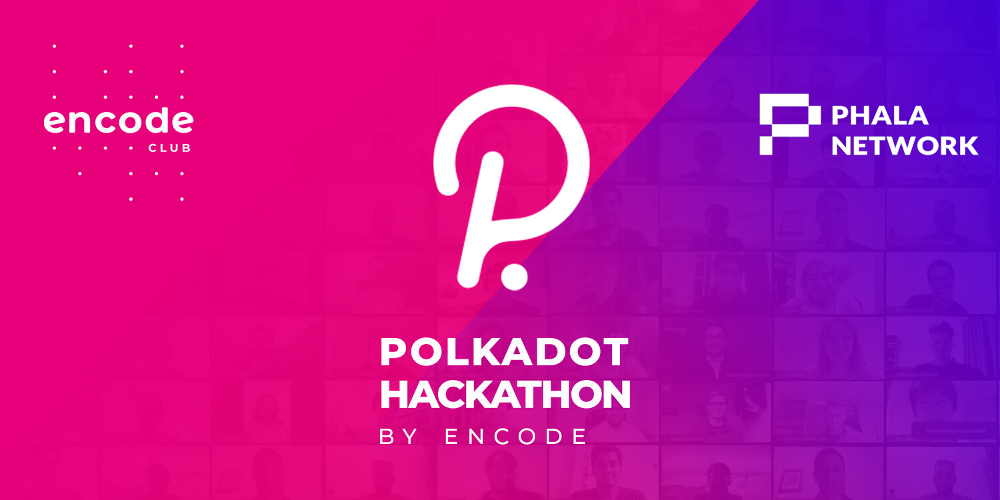
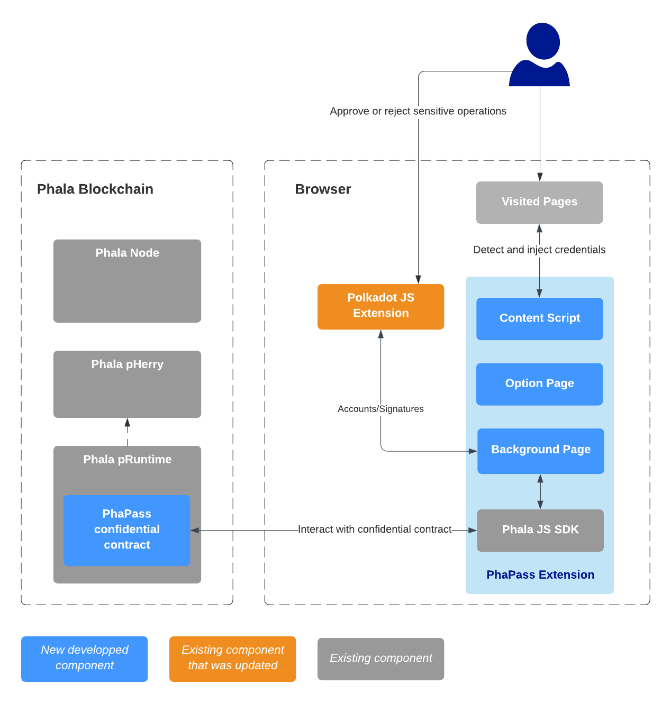

**A project for the [Advanced Phala Challenge](https://github.com/Phala-Network/Encode-Hackathon-2021/blob/master/advanced-challenge.md) of the [Encode Polkadot Hackathon](https://www.encode.club/polkadot-club-hackathon).**

This project tries to demonstrate how we could rely on the Phala Confidential Contract feature to keep track of passwords.

[This repository](https://github.com/LaurentTrk/phapass) holds the PhaPass blockchain code, which implements the [PhaPass contract](https://github.com/LaurentTrk/phapass/blob/phapass/crates/phactory/src/contracts/phapass.rs).

See the [Phala instructions](https://github.com/LaurentTrk/phapass/blob/phapass/README.phala.md) on how to build and run the blockchain.

The frontend part of this project is served by a [Chrome Extension](https://developer.chrome.com/docs/extensions/) based on the [Phala JS SDK](https://github.com/Phala-Network/js-sdk). The related code can be found in [this fork](https://github.com/LaurentTrk/js-sdk).

**As a Hackathon project, this is not ready for production use. Use it at your own risks :)**
{: .alert .alert-warning .box-warning}

## Inspiration

I have been using a password manager for many years now, but sometimes I have doubts about the privacy and security of the data I store there.

Of course, these applications are often opensource and regularly audited, but they are still proprietary solutions, or you have to manage the synchronization and backup of your data yourself, often using other proprietary cloud solutions.

All this remains very centralized...

I discovered [Phala](https://phala.network/) last year during the [Polkadot Hello World hackathon](https://gitcoin.co/hackathon/polkadot/onboard), and I thought that this decentralized blockchain and its [trusted and confidential](https://phala.network/en/technology) nature could be the perfect candidate for an experimentation around password management.

And so here is the **PhaPass** project, which aims to demonstrate how you can use the Phala blockchain to store your passwords and use them directly in your favorite browser :)

## What it does

### Store your passwords in a Phala confidential contract

### From a technical point of view

Technically, the project is all about developing a Phala contract to store and deal with user credentials, and a Chrome Browser Extension that will use this contract.

* **PhaPass Confidential Contract** : the contract running in the Phala blockchain.
* **Background Page** : this page interacts with the confidential contract using the Phala JS SDK. It serves as a 'backend' for the content script and the options page. 
* **Option Page**: the unique UI of the extension. It displays a tutorial for the user vault creation, or the list of the user credentials.
* **Content Script**: this code is injected into the visited page, it detects manually input credentials to save to the user vault, or inject already saved credentials in visited page.

## How I built it

### Create a minimal contract 

### Create a minimal Chrome extension

### Change the Polkadot.JS extension

### Integrate the Phala JS SDK

### Enhance the PhaPass contract

### Add local encryption

### Enhance extension UI

### Fix bugs ;)

## Challenges I ran into

* Integrating the JS SDK in the extension 
* Calling the Polkadot.JS extension from another extension
* Implementing the decryption feature to the Polkadot.JS extension (still a _work in progress_)
* Coding for the first time in Typescript

## What's next

The minimal viable product works :) but it's still a lot of work to do :

* At this time, only simple HTML form is correcly detected, there is so many ways to input passwords in web pages ! And we should support them all...
* Not to mention that we need to support others browsers.
* Some features need to be integrated to the Polkadot JS extension : [external listeners](https://github.com/polkadot-js/extension/issues/849) and encryption/decryption
* [sr25519 account pairs seems not supported for encryption/decryption](https://github.com/polkadot-js/common/issues/1124) which is a strong limitation as sr25519 is the default type for Polkadot.
* As soon as public contracts are available on Phala (Ink! Contract ?), it _could_ make sense to use them.
* _(Most of)_ Edge/error cases are not handled correclty.
* The extension needs to be [published](https://developer.chrome.com/docs/webstore/publish/). 
* **Basic features:** add credential manually, change credential, generate random password, lock vault
* **'Nice to have' features:** delegate your password to another user, import/export

I hope you enjoy this project as much as I enjoyed to do it !

Thank you for reading me.
